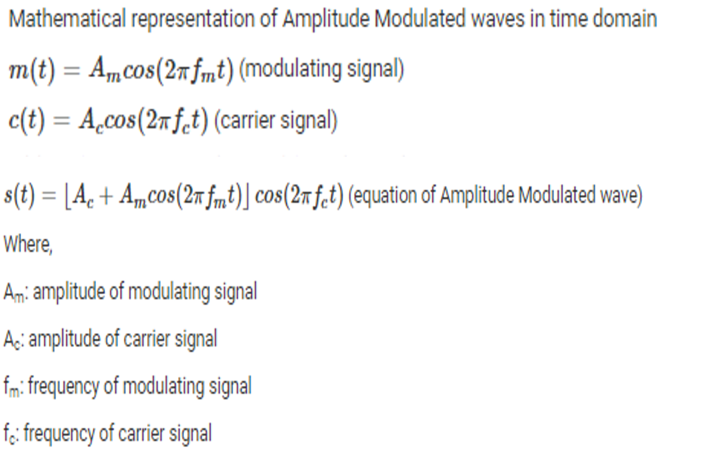
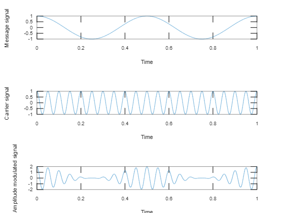

- Definition: It is the process of modulation by which the amplitude of  carrier signal is varied in accordance with the instantaneous amplitude of the message signal.

- Algorithm
    - Generate message signal and display
    - Generate carrier signal and display
    - Generate AM signal

> Note: For modulation frequency of the carrier is more than frequency of the message signal.

