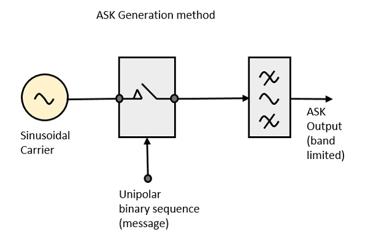
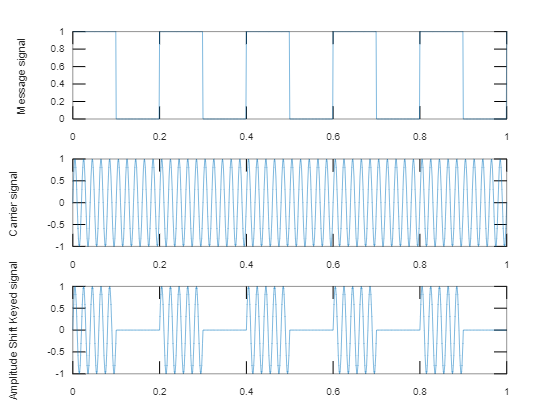

## **Definition**
- In  ASK modulated signal, there will be absence of carrier for   Low input(ie input data is 0) 
- In  ASK modulated signal, there will be presence of carrier for   HIGH input(ie input data is 1)

## **Diagram**



## **Algorthm**
- Generate message signal (binary) and display
- Generate carrier signal and display
- Generate ASK signal


## **Output**:
````
amp = 1
fm = 5
fc = 50
````
> 


