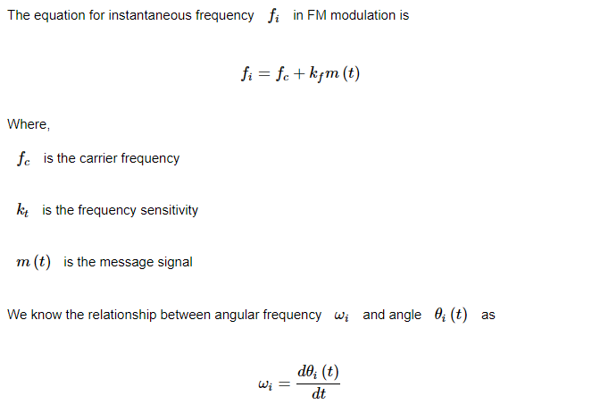
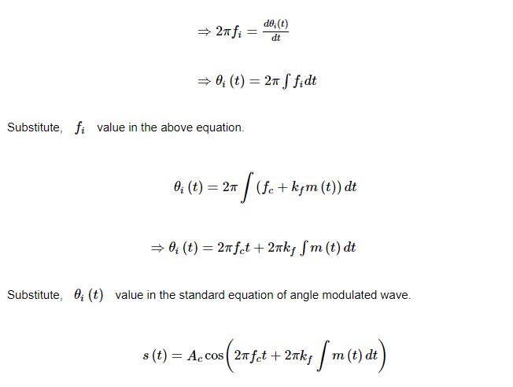
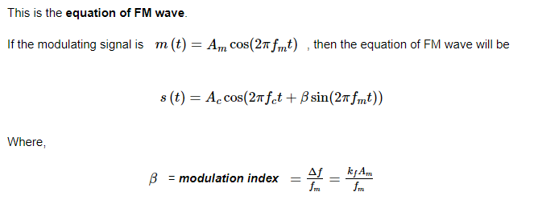
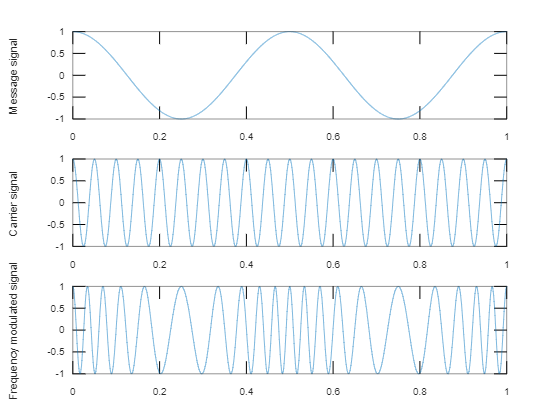

## **Definition**
It is the process of modulation by which the frequency of  carrier signal is varied in accordance with the instantaneous amplitude of the message signal.

## **Derivation**




## **Algorthm**
- Generate message signal and display
- Generate carrier signal and display
- Generate FM signal

> Note: For modulation frequency of the carrier is more than frequency of the message signal.

## **Output**:
````
fm = 2
Am = 1
fc = 20
Ac = 1
B = 5
````
> 

