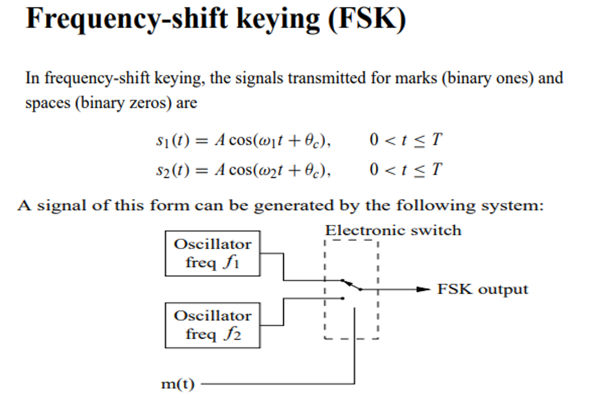
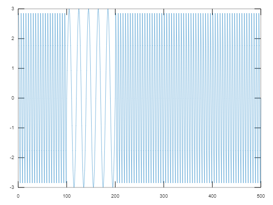

## **Definition**
- In FSK, two carrier signals are used to produce FSK modulated waveforms.
- The reason behind this, FSK modulated signals are represented in terms of two different frequencies. 
- The frequencies are called “mark frequency” and “space-frequency”. Mark frequency has represented logic 1 and space-frequency has represented the logic 0. 
- There is only one difference between these two carrier signals, i.e. carrier input 1 having more frequency than the carrier input 2.


## **Diagram**


## **Advantages**
- Simple process to construct the circuit
- Low probability of error
- High SNR (signal to noise ratio)
- More noise immunity than the ASK
- Error-free reception can be possible with FSK
- Useful in high-frequency radio transmissions
- Low-speed digital applications

## **Disadvantages**
- It requires more bandwidth than the ASK and PSK(phase shift keying)
- Due to the requirement of large bandwidth, this FSK has limitations to use only in low-speed modems which the bit rate is 1200bits/sec.


## **Algorthm**
- Generate message signal (binary) and display
    - or use a predefined binary stream
- Generate two carrier signal of clearlydifferent frequencies and display
- Generate FSK signal


## **Output**:
````
f1 = 20
f2 = 5
````
> 


