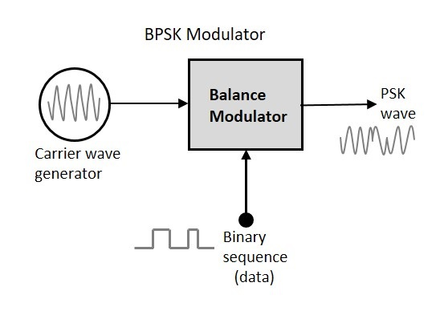
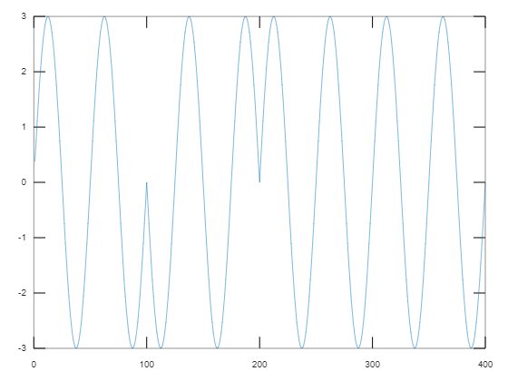

## **Definition**
- In this technique, when the data bit is high the carrier is unaltered whereas when the data bit is low 180 degree phase shift occurs.
- So, the single sine  or cosine wave carrier takes two phase reversals such as 0° and 180°(pi).


## **Diagram**



## **Algorthm**
- Generate message signal (binary) and display
    - or use a predefined binary stream
- Generate a carrier signal and display
- Generate PSK signal


## **Output**:
````
f1 = 2
````
> 


