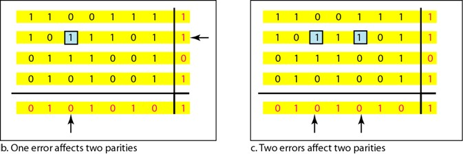

## **Definition**
- Two Dimensional Parity can detect as well as correct one or more bit errors. If a one or more bit error takes place then the receiver will receive the message with the changed parity bit. It indicates that some error has taken place which means the error is detected.
- Parity check bits are calculated for each row, which is equivalent to a simple parity check bit. Parity check bits are also calculated for all columns, then both are sent along with the data. At the receiving end these are compared with the parity bits calculated on the received data.

## **Diagram**

## **Performance**

## **Advantages**
- Can catch some sorts of burt errors
- There is a chance to detect the fault bit and correct the same

## **Disadvantages**
- Not capable of finding all errors. If 2 errors ouccur in the same row or column, there is a chance that 2D Parity check wont detect thhe error successfully
- Too many check bits are added, increases data size